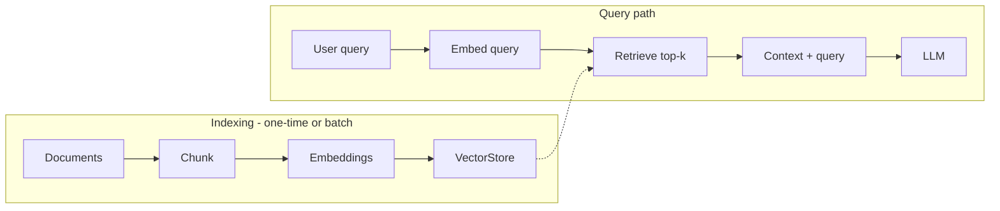
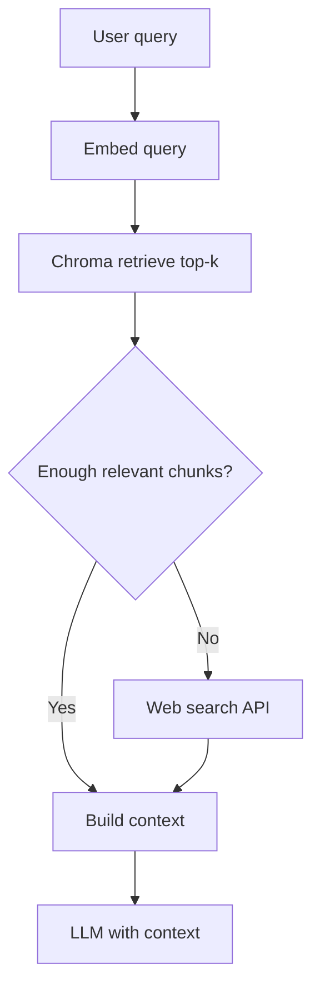

# RAG gaps and what to add

## Current state: no RAG

The laptop guide is **not** using RAG. It only does:

- **[service.py](laptop_guide/service.py)**: Loads `GEMINI_API_KEY`, defines a static `LAPTOP_SYSTEM_PROMPT`, and calls `ChatGoogleGenerativeAI` with the user query. No documents, no retrieval.
- **[views.py](laptop_guide/views.py)**: Receives the query and returns `get_laptop_answer(query)` as JSON.

So the model answers from its general knowledge and the fixed prompt only. There is no document store or retrieval step.

---

## What RAG requires (and what’s missing)

Conceptually, RAG adds a retrieval step before the LLM: **index documents → at query time retrieve relevant chunks → send chunks + query to the LLM**.

**Query path with web fallback:**

---

| Component               | Status  | What to add                                                                                                                                                                              |
| ----------------------- | ------- | ---------------------------------------------------------------------------------------------------------------------------------------------------------------------------------------- |
| **Document corpus**     | Missing | Laptop-related content (e.g. markdown/HTML/text or structured JSON) that the app should base answers on. None exists in the repo today.                                                  |
| **Chunking**            | Missing | Logic to split documents into chunks (e.g. by section or by token/size). LangChain has `RecursiveCharacterTextSplitter` and similar.                                                     |
| **Embeddings**          | Missing | An embedding model (e.g. Google `text-embedding-004` or OpenAI) and code to embed chunks and the user query.                                                                             |
| **Vector store**        | Missing | A store for embeddings (e.g. Chroma, FAISS, or LangChain’s `InMemoryStore` for a minimal setup). Must be created and persisted (or rebuilt on startup) from the chunked + embedded docs. |
| **Retrieval**           | Missing | At request time: embed the query, run similarity search, get top-k chunks.                                                                                                               |
| **Prompt integration**  | Missing | Change `get_laptop_answer` so the prompt includes the retrieved chunks as context (e.g. “Use the following context to answer: …”) and the user question.                                 |
| **Index build/refresh** | Missing | A way to (re)build the vector index when documents change (e.g. management command or script, or one-time script).                                                                       |
| **Web search fallback** | Missing | When retrieval is empty or below a relevance threshold, call a search API (e.g. Tavily or Serper) and pass returned snippets to the LLM as context.                                      |

---

## Confirmed choices

- **Embeddings**: Google (`GoogleGenerativeAIEmbeddings`, e.g. `gemini-embedding-2-preview`); same API key as Gemini where applicable.
- **Vector store**: Chroma (persisted on disk via `langchain-chroma` + `chromadb`).
- **Document source**: Web crawling — fetch laptop-related pages, extract text, use as RAG corpus.
- **Fallback**: When RAG returns no or low-relevance results, call a web search API and use the search results as context for the LLM.

---

Also useful but not strictly RAG:

- **Config**: No `.env.example` in this app; only `GEMINI_API_KEY` is used. If you add embeddings/vector DB, you may need extra env vars (e.g. embedding API key, Chroma path).
- **Run instructions**: No README here; run instructions would live in the parent Django project.

---

### Recommended additions (crawler + Chroma + web fallback)

1. **Web crawler** — Seed list of laptop URLs (e.g. `config/seed_urls.txt`). Use `WebBaseLoader` from `langchain_community.document_loaders` to fetch and extract text; set `requests_per_second`. Optionally save to `data/crawled/`. Run via management command or schedule.
2. **Dependencies** — In parent `requirements.txt`: `langchain-google-genai`, `langchain-chroma`, `chromadb`, `langchain-community`, `langchain-text-splitters`, `beautifulsoup4`; for fallback `tavily-python` or Serper.
  In the parent project’s `requirements.txt` (or equivalent), add at least:
  - LangChain (or `langchain-google-genai`) for embeddings if using Google (e.g. `text-embedding-004`).
  - A vector store: e.g. `chromadb` or `faiss-cpu` and LangChain’s integration.
3. **RAG pipeline in code**
  - **Chunking**: Load docs → split with `RecursiveCharacterTextSplitter` (or similar).  
  - **Embeddings**: Use the same embedding model for chunks and for the query.  
  - **Vector store**: Build an index from chunk embeddings (e.g. Chroma from documents or FAISS from a list of embeddings). Persist it (e.g. Chroma on disk or a FAISS file) so you don’t rebuild on every request.  
  - **Retrieval**: Expose a function that takes a query string and returns the top-k chunks (e.g. via LangChain `Retriever` or direct similarity search).  
  - `**get_laptop_answer`**: Call the retriever with the user query, then invoke the LLM with a prompt that includes the retrieved context plus the question (and keep your existing system prompt if desired).
4. **Index build**
  Add a Django management command (or script) that: loads documents → chunks → embeds → builds and saves the vector store. Run it when docs change or on first deploy.
5. **Env and docs**
  Add a `.env.example` listing `GEMINI_API_KEY` (and any new keys for embeddings/API). Optionally document in the parent project how to run the app and how to rebuild the RAG index.

---

(Design choices are fixed: Google embeddings, Chroma, web-crawled source, web search fallback.)